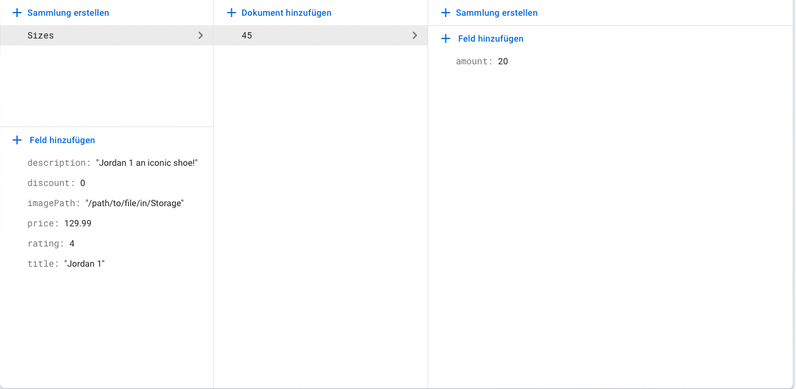

# ShopApp
Disclaimer: 
This version includes credit card as a payment method, processed through Stripe. If you want to create the project without a real payment method go to the main-payment branch and follow the instructions there. This instruction uses the test-mode of stripe. This instruction doesn't explain the details of Firebase, Firestore and Storage. Make sure you are a little bit familiar with Firebase and its products.

Description: 
E-commerce application for the iOS platform, developed in SwiftUI. You can create an account, add items to your favourites and buy them with credit card. The database is managed by Firebase. 

Why I have built this project: 
I created this project to learn more about Firebase and how to deal with deeper collection structures in Firestore. I was interested in the field of e-commerce and how such an application is built. It is clear to me that the security of this project cannot match the security of big companies that make money every day with e-commerce, but I learned a lot, e.g. user interface, real payment process MVVM (this is a point I can definitely put more work into) and I created two animations when you click on the buttons "Add to cart" and "Add to favourites". Please keep in mind that this shouldn't be something to use in the real world. It is just a side project for educational purposes. The brands on the pictures are not property of me. 

Images 

Download (all commands are marked with ' '): 
1. Download it via Github and open the ShopApp.xcodeproj file in Xcode.
2. Change the bundle Identifier to the desired name and make sure to select a developer account.
3. Create a Firebase Project on https://console.firebase.google.com without Analytics.
4. The packages FirebaseAuth, FirebaseFirestore, FirebaseStorage should be added already via SPM that means if everything worked fine, you can skip step 5 
5. Add the iOS Application to Firebase. Follow the given instructions on Firebase to add it via the Swift Package Manager(SPM) (More Information: https://firebase.google.com/docs/ios/installation-methods). You can ignore the step with the Initialization code.
6. Now create a Firestore Database and make sure that you can read and write to it. You can change this in the rules of the Database.
7. Create a collection named Items. Create an item object in this collectoin. It should look like this:  Please upload an product image to Storage and the variable imagePath should contain the matching URL from FirebaseStorage.
8. Add FirebaseAuth with Email and Password as the sign-in method.
9. Create an account on the stripe website stripe.com
10. Add the stripe package to your Xcode Application. Follow the steps in the tutorial(https://stripe.com/docs/payments/accept-a-payment) named "1. Set up Stripe Client-side"(This step can be skipped if everything worked fine, as the package should already be installed.) 
11. Go to stripe.com->Dashboard->Developer->API-Keys and search for the secret and publishable API key.
12. Open the folder stripeDB in your desired IDE.
13. Open a terminal window and create a virtual environment with 'python3 -m venv placeholderforname'
14. Execute the command '. placeholderforname/bin/activate'.
15.Install Flask and Strip with 'pip install flask' and 'pip install stripe'.
16. Insert your publishable and secret API keys into the Python server and iOS client. The values of the variables where you should insert them are marked in the code with "YOURSECRETAPIKEY" and "YOURPUBLISHABLEAPIKEY".
17. Set the server with 'export FLASK_APP=server.py'
18. Run the server with 'flask run'
19. Now run the app in XCode

Usecases: 
Create own items in the Firebase Database and get an idea of e-commerce and payment process with Stripe. 

Credits: 
To create a star view, I used this code: https://swiftuirecipes.com/blog/star-rating-view-in-swiftui 
These YouTube videos helped me understand Firebase: https://youtube.com/playlist?list=PLimqJDzPI-H-6rBS1I3VciIsAWG9RZa8o 
I used some icons from https://shape.so and it is free personal use so please check it out.(Disclaimer: I deleted them from my source code because this doesn't count as personal use) 
This tutorial helped me to set up Stripe to process payments https://stripe.com/docs/payments/accept-a-payment 

Things to improve:  
1.Rating system. To this day it is not possible to rate a product.

